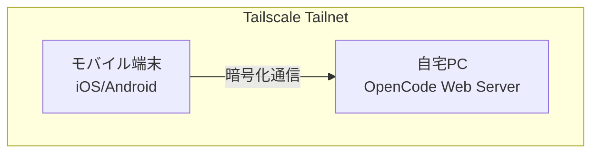

外出先でもスマートフォンやタブレットからAIコーディングエージェントを使いたい。そんなときに便利なのが、OpenCodeのWebインターフェースとTailscaleの組み合わせだ。

<!--more-->

## 背景

OpenCodeはターミナル上で動作するAIコーディングエージェントだが、`opencode web` コマンドでブラウザからも利用できる。これを自宅のPC上で起動しておき、外出先のモバイル端末からアクセスできれば、電車の中やカフェでも開発が進められる。

ただし、単に `--hostname 0.0.0.0` を指定してポートを開放するのはセキュリティ的に不安だ。そこでTailscaleを使い、VPN越しに安全にアクセスする構成を組んだ。

## 必要なもの

- OpenCodeがインストールされた開発PC（Linux/macOS/Windows WSL）
- 同じPCにインストールされたTailscale
- モバイル端末（iOS/Android）にTailscaleアプリ
- 同じTailnetに参加していること

## 構成



Tailscaleはデバイス間を暗号化されたメッシュVPNで接続する。同じTailnet内にあれば、外部からのポート開放や固定IPは不要で、MagicDNSを使ってデバイス名でアクセスできる。

## 手順

### 1. OpenCode Webを起動する

開発PCで、プロジェクトディレクトリに移動してから以下を実行する。

```bash
OPENCODE_SERVER_PASSWORD=your-secure-password opencode web --hostname 0.0.0.0 --port 4096
```

ポイントは以下の通り。

- `--hostname 0.0.0.0`: ローカルホスト以外からのアクセスを許可する
- `--port 4096`: ポートを固定する（省略時はランダム）
- `OPENCODE_SERVER_PASSWORD`: ネットワーク公開時の認証パスワード

パスワードを設定しないとサーバーが無防備になるため、必ず設定すること。デフォルトのユーザー名は `opencode` だが、`OPENCODE_SERVER_USERNAME` で変更も可能だ。

### 2. Tailscaleで確認する

開発PCがTailscaleに接続されていることを確認する。

```bash
tailscale status
```

開発PCのTailscale IP（100.x.x.x）またはMagicDNS名（`your-pc.tailabc.ts.net` など）を控えておく。

### 3. モバイル端末からアクセスする

1. モバイル端末のTailscaleアプリを起動し、同じTailnetに接続する
2. ブラウザで `http://<開発PCのTailscale IP>:4096` または `http://<MagicDNS名>:4096` を開く
3. Basic認証ダイアログが表示されたら、ユーザー名 `opencode` と設定したパスワードを入力する

これでOpenCodeのWebインターフェースが表示され、モバイル端末からでもコードの閲覧・編集・AIへの指示ができる。

## セキュリティの考慮事項

- **認証パスワードは必須**——`OPENCODE_SERVER_PASSWORD` を設定しないと誰でもアクセスできてしまう
- **Tailscale ACLの活用**——TailscaleのACLを使って、OpenCodeサーバーへのポートアクセスを特定のデバイスやユーザーに絞ることもできる
- **mDNSは慎重に判断する**——`--mdns` を有効にすると `opencode.local` などでLAN内に広報されるが、Tailscale越しの利用を想定するなら不要だ

## 実際の使い心地

ブラウザからの操作はターミナル版と同じセッション管理が使える。`opencode attach` でTUIからも同じセッションに接続できるため、PCではターミナル、外出時はモバイルブラウザと使い分けることも可能だ。

画面サイズが小さい端末では、コードレビューや軽微な修正に留めるのが現実的だが、「電車の中で急ぎのバグ修正をAIに頼む」というシーンには十分使える。

## まとめ

OpenCode Web + Tailscaleの組み合わせにより、モバイル端末から安全にAI開発環境にアクセスできる。特に以下の点が便利だ。

- ポート開放や固定IP不要
- Tailscaleの暗号化通信で安全
- MagicDNSでIPアドレスを気にせずアクセス
- 認証機能で不用意なアクセスを防ぐ

自宅の高性能な開発PCをそのままAIエージェントのホストとして使い、外出先からも手軽に開発を続けたい人にはおすすめの構成だ。
